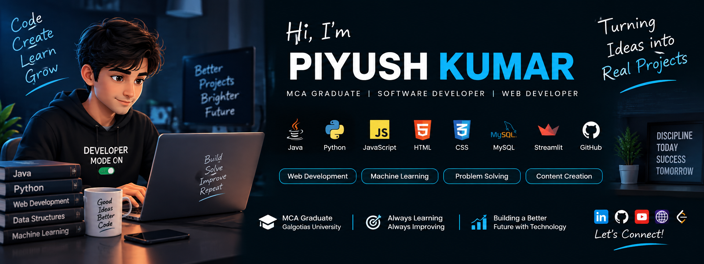

  

<h1 align="center">Hi, I'm Piyush Kumar 👋</h1>

  <strong>MCA Graduate | Software Developer | Web Developer | Python & Java</strong>

  Building practical projects and solving real-world problems through technology.

---

## 👨‍💻 About Me

- 🎓 MCA Graduate – Galgotias University
- 💻 Interested in Software & Web Development
- ☕ Java | 🐍 Python | ⚡ JavaScript
- 🌐 HTML5 | CSS3 | Responsive Web Design
- 🗄️ MySQL | Firebase
- 🤖 Machine Learning
- 🧩 Data Structures | OOP | Problem Solving
- 🛠️ Git | GitHub | VS Code | Eclipse | Streamlit
- 🚀 Streamlit | Firebase | Netlify | GitHub Pages
- 📊 SEO | Content Management | Google Analytics

---

## 🚀 Featured Projects

### 🌦️ Offline Weather Prediction Using Ensemble Machine Learning

A weather forecasting web application developed using Python and Streamlit.

**Technologies:**  
`Python` `Streamlit` `Machine Learning` `Weather APIs`

**Highlights:**
- Weather prediction using machine learning models
- Weather API integration
- Interactive dashboard
- Data analysis and visualization

---

### 🎁 Gift Shop Management System

Inventory and billing management software developed using Java and MySQL.

**Technologies:**  
`Java` `MySQL` `OOP`

**Highlights:**
- Product management
- Inventory management
- Billing functionality
- Database operations

---

### 📰 GNews

A web-based news application designed to provide users with an easy way
to browse and explore news content.

**Technologies:**  
`HTML` `CSS` `JavaScript`

**Highlights:**
- Responsive web interface
- News content integration
- User-friendly interface
- Deployed web application

---

### 📺 TV Serial Twist

An entertainment content website developed and managed as a personal project.

**Technologies:**  
`HTML` `CSS` `JavaScript` `SEO`

**Highlights:**
- Website development and management
- Digital content publishing
- SEO optimization
- Website workflow management

---

## 🛠️ Technical Skills

### 💻 Programming
`Java` `Python` `C` `JavaScript`

### 🌐 Web Development
`HTML5` `CSS3` `Responsive Design`

### 🗄️ Database
`MySQL` `Firebase`

### 🤖 Core Concepts
`Data Structures` `OOP` `Software Engineering` `Machine Learning`

### 🔧 Tools
`Git` `GitHub` `VS Code` `Eclipse` `Streamlit`

### 🚀 Deployment
`Streamlit` `Firebase` `Netlify` `GitHub Pages`

### 📈 Digital Skills
`SEO` `Content Management` `Digital Marketing` `Google Analytics` `Blogger`

---

## 📚 Currently Learning

- Advanced Java & Object-Oriented Programming
- Python Development
- JavaScript & Web Development
- Data Structures & Problem Solving
- Machine Learning
- Building practical real-world applications

---

## 🏆 Achievements & Certifications

- 🎓 MCA – Galgotias University
- 💻 Active problem solver on LeetCode
- 📺 Built and managed a YouTube channel
- 🌐 Developed and managed an entertainment website
- 📜 Web Development Training – Internshala
- 🌐 Cisco Networking Essentials Certification
- 📊 Deloitte Data Analytics Job Simulation

---

## 🎯 Career Interests

Seeking entry-level opportunities in:

`Software Development` · `Java Development` · `Web Development` ·  
`Frontend Development` · `Python Development` · `IT`

---

## 📊 GitHub Activity

  

  

---

## 📫 Connect With Me

---

  <strong>💡 Learn by building. Improve by solving.</strong>

  Thanks for visiting my profile! ⭐

